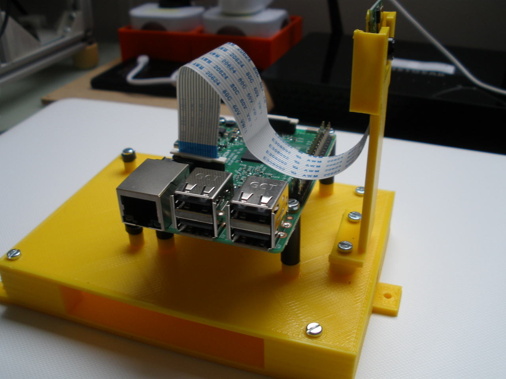

<!--# RaspiBot -->
<!--+ 2016-2017 -->
<!--$ Python-->
<!--$ Arduino -->
<!--$ Bluetooth -->

<!--% Un robot avec retour vidéo et contrôle par Bluetooth -->

# RaspiBot

Un robot avec retour vidéo et contrôle par Bluetooth

## Sommaire

- Caméra : Toutes les informations sur la caméra et son contrôle

- Code_Arduino : Le code du robot avec les bibliothèques Arduino

- Code_essais : Les codes d'essais des moteurs, caméra...

- Fichiers TSL : Les fichiers STL du projet

- Images : Les images du projet

- Instructions : Les instructions du montage du robot

- Moteurs : les instructions et calculs pour le dimensionnement des moteurs

- 

## Liste du matériel

- 1 ordinateur embarqué Raspberry Pi3 Modèle B 1GB
- 1 Alimentation Micro USB 5V 2,5A pour Raspberry Pi3 et power bank
- 1 Power bank Li-polymer 10000 mAh sorties 1 et 2,1A pour alimentation Rpi3 en autonome
- 1 Module caméra 5MP pour Raspberry Pi3
- 1 carte mémoire microSDHC SanDisk 16 Go, Classe 10

- 1 ensemble support pour Rpi3, carte Arduino et caméra en PLA jaune ( avec visserie et entretoises )

## Informations pratiques

- L'ensemble support avec son Rpi3, sa carte Arduino, sa caméra et la batterie « power bank » sera par la suite intégré au robot roulant.

- La batterie power bank s'insère dans l'espace sous le Rpi3 – carte Arduino. Elle assure l'alimentation de l'ensemble Rpi3-carte Arduino-caméra pour assurer l'autonomie du robot roulant. Son utilisation sera vue par la suite.

- Le support de caméra est provisoire, il sert uniquement à assurer un positionnement en toute sécurité de la caméra pendant les essais.

- Installation de la caméra :

    - Insérer le circuit imprimé dans son support, la nappe vers le bas. 
    - Le connecteur de la carte est celui entre la prise son et la prise hdmi ,noté caméra sur la carte,
    - Relever avec précaution le bloqueur blanc, il se relève de quelques millimètres,
    - Insérer la nappe, contacts vers la prise hdmi, partie bleue vers le port RJ45
    - Ré appuyer sur le bloqueur pour bien fixer.

- L'alimentation ( chargeur ) est utilisée pour alimenter le Rpi3 pour la prise en main du Rpi3 ( installation du logiciel d'exploitation, configuration, chargements des logiciels permettant la prise de contrôle à distance du Rpi3 et du contrôle des flux vidéo sur l'ordinateur distant ).
